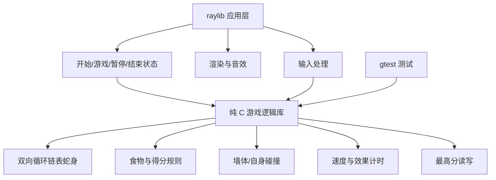

# project.md

## Summary

开发一个 Windows 优先的单机版 PC 贪吃蛇小游戏，使用 C11 + raylib + CMake 实现。游戏逻辑用纯 C 模块编写，蛇身必须用双向循环链表表示；raylib 只负责窗口、输入、绘制、音效和界面状态。

核心目标是做出一个完整、有趣、可手动验收的小游戏，同时通过代码注释、gtest 测试和可开关调试叠层帮助学习双向循环链表。

## Phase Status

- Phase 0：项目骨架，已完成。
- Phase 1：界面主流程，已完成。
- Phase 2：链表逻辑测试设计与实现，已完成。
- Phase 3：基础游戏联动，已完成。
- Phase 4：食物与速度规则测试，已完成。
- Phase 5：表现层完善，已完成。
- Phase 6：链表调试叠层与最终验收，已完成，等待用户最终验收。

## Architecture

## Acceptance Rules

- 每个 UI Phase 完成后必须构建并弹出窗口，由用户手动确认通过后才能继续。
- 每个游戏逻辑 Phase 写 gtest 前，必须先给用户审核测试用例清单；确认后再实现和运行测试。
- 游戏逻辑必须使用双向循环链表表示蛇身，不能用数组替代核心蛇身结构。
- 核心逻辑必须可被 gtest 独立测试，不依赖 raylib。
- 代码必须包含中文详细注释，便于学习链表使用场景。
